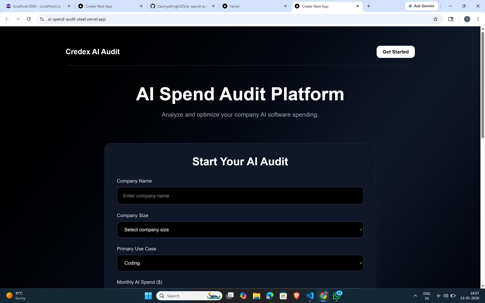
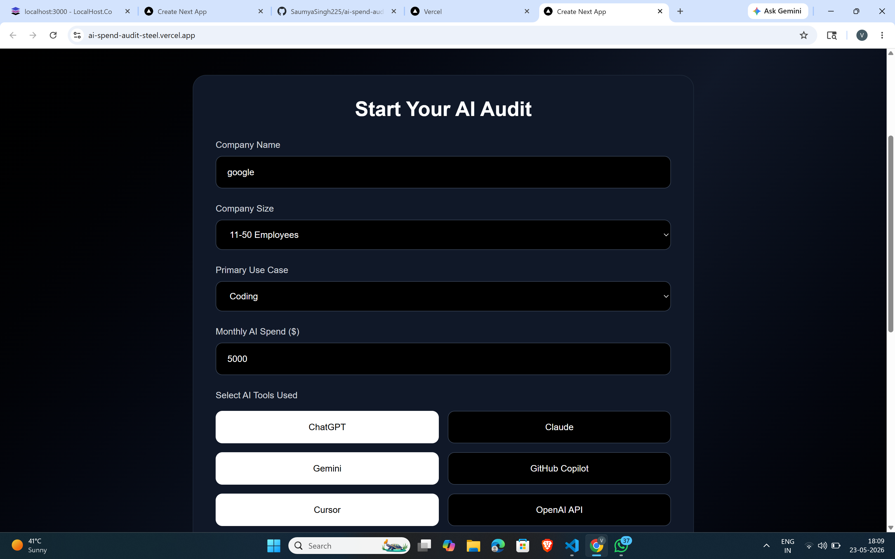
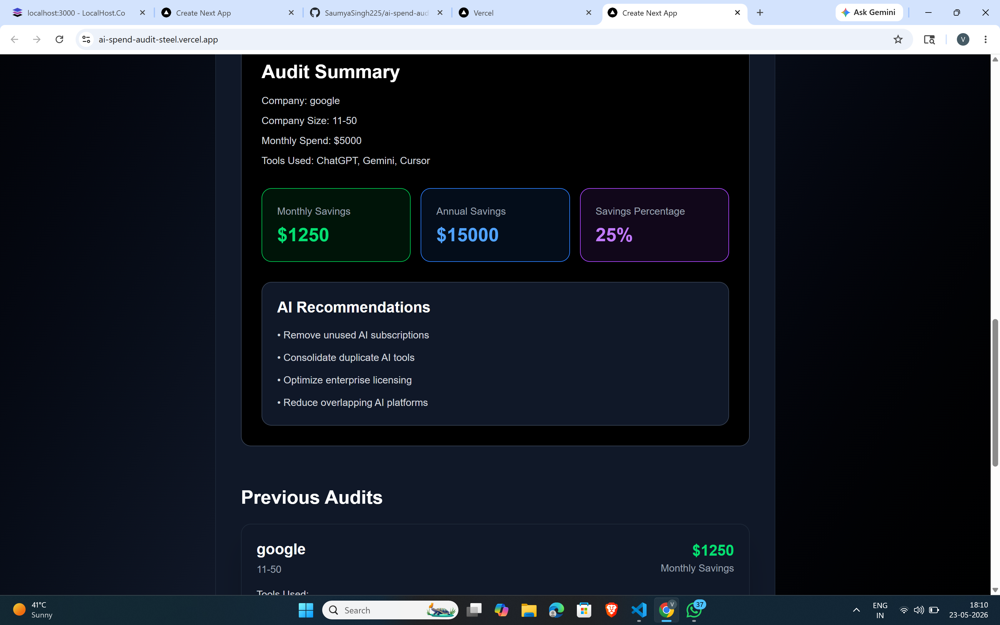

# AI Spend Audit Platform

A full-stack AI spend optimization platform built using Next.js, React, TypeScript, and Tailwind CSS.

## Features

- AI spend analysis
- Smart recommendations
- Savings dashboard
- Audit history
- Responsive UI
- AI tool recommendations

## Tech Stack

- Next.js
- React
- TypeScript
- Tailwind CSS
- Vercel Deployment

## Deployment

Live Project:
https://ai-spend-audit-steel.vercel.app/

## Screenshots

### Homepage

### Formpage

### Audit Results

## Learnings

This project helped me learn:
- React state management
- Next.js API routes
- Tailwind CSS
- GitHub workflow
- Deployment using Vercel
- Debugging frontend issues

## Future Improvements

- Add database integration
- Add authentication
- Add advanced analytics dashboard
- Add real AI pricing APIs 